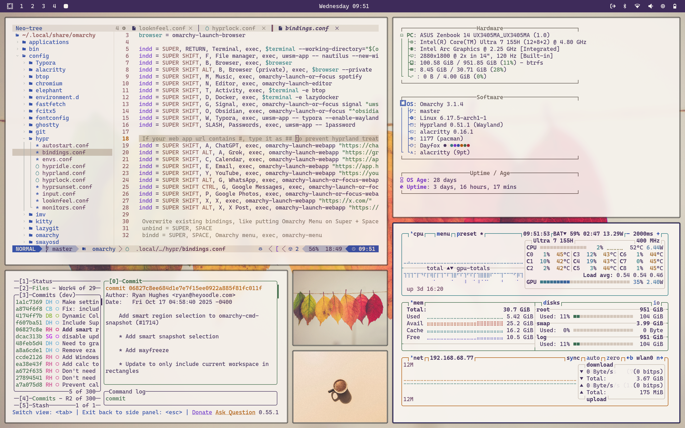

# RubyLLM Light Theme for Omarchy

RubyLLM Light is a warm, paper-toned Omarchy theme sampled from the RubyLLM Homepage 4.0 design.



## Install

```bash
omarchy-theme-install https://github.com/crmne/omarchy-ruby-llm-theme
```

Then activate:

```bash
omarchy-theme-set ruby-llm
```

## What's Included

- Terminal palettes: `alacritty.toml`, `ghostty.conf`, `kitty.conf`
- WM/UI styling: `hyprland.conf`, `hyprlock.conf`, `waybar.css`, `walker.css`, `swayosd.css`
- Notifications/system: `mako.ini`, `btop.theme`, `icons.theme`
- Editor integration: `neovim.lua`, `vscode.json`
- Browser seed color: `chromium.theme`
- Wallpapers: `backgrounds/`

## Core Colors

- Background: `#f7f3f1`
- Surface: `#faf9f7`
- Section tint: `#f3ece7`
- Foreground: `#3a3430`
- Muted text: `#726f6c`
- Ruby red: `#b30000`
- Ruby bright: `#c9271e`
- Semantic green: `#396847`
- Semantic blue: `#205ea6`
- Semantic teal: `#287980`

## Notes

- This theme includes temporary wallpaper picks that will be replaced in a later pass.
- VS Code integration uses Catppuccin Latte (`catppuccin.catppuccin-vsc`).

## License

[MIT](LICENSE)
