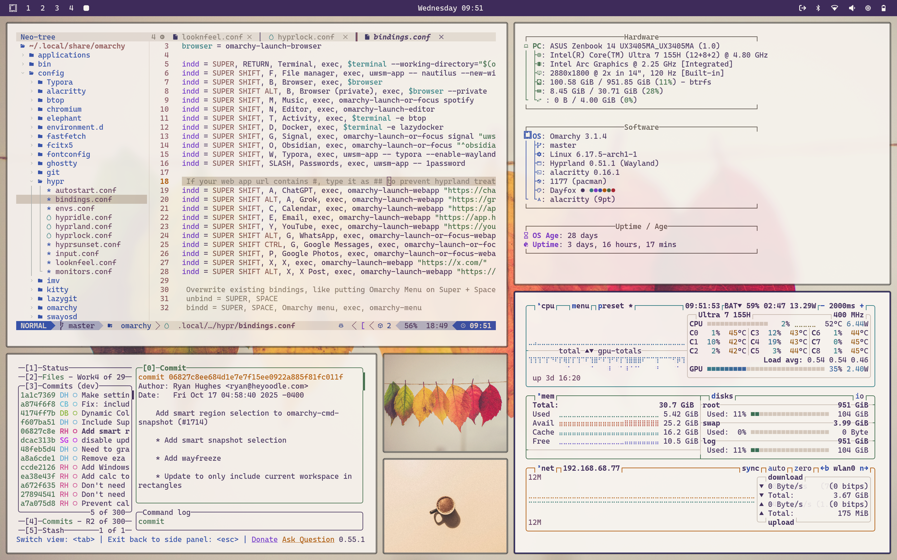

# RubyLLM Light for Omarchy Quattro

A warm, paper-toned theme sampled from the RubyLLM visual identity.



## Install

```bash
omarchy theme install https://github.com/crmne/omarchy-ruby-llm-theme.git
```

Activate it with:

```bash
omarchy theme set ruby-llm
```

## Architecture

This is a declarative Omarchy Quattro theme. It provides only:

- A semantic palette in `colors.toml`
- A GNOME icon theme choice in `icons.theme`
- Wallpapers in `backgrounds/`
- A selector preview in `preview.png`

Omarchy generates and applies the terminal, shell, Hyprland, editor, browser,
Obsidian, keyboard, and btop integrations from the semantic palette. The theme
contains no executable hooks, package installation, or application-specific
configuration files.

## Core colors

- Background: `#f7f3f1`
- Foreground: `#3a3430`
- Muted: `#726f6c`
- Ruby red: `#b30000`
- Bright ruby: `#c9271e`
- Green: `#396847`
- Blue: `#205ea6`
- Cyan: `#287980`

## Requirements

Omarchy 4 (Quattro) or newer.

## License

[MIT](LICENSE)
